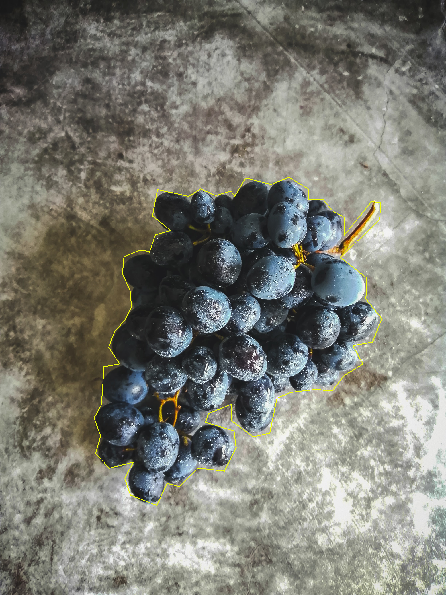
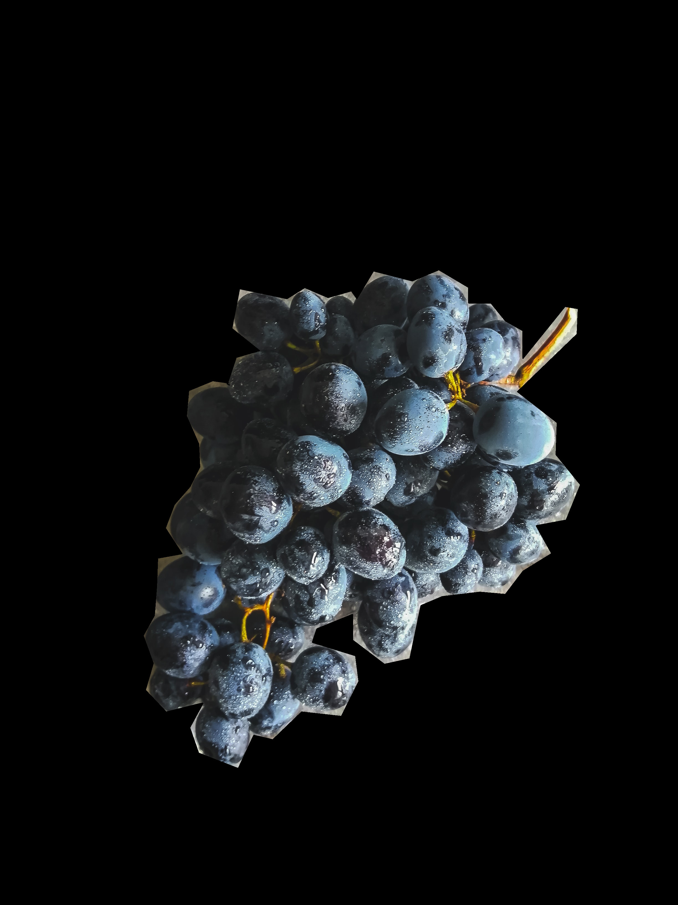
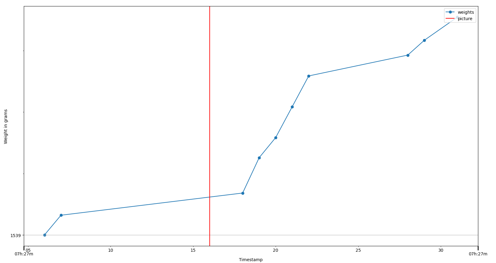

# The photoscaledataapi package - publicly available snapshot of v2.3

This package was developed for a company, which we will call "Photoscale".
Our descriptions will be slightly vague for anonymity reasons.

The user of the company's product is supposed to take pictures of objects (specifically "ingredients" (food) in the examples below, but can easily be generalised to other kinds of objects) of which they want to register the weight, and then put the object on a container which is on a scale.
The company's software segments a polygon with the object from the image, classifies the object and attributes it a weight using the scale weight fluctuations.
If the picture does not contain any classifiable object, it is labelled as an "invalid" or "discarded" picture.

This package helps the user easily fetch images, polygons, weight curves and related info from Photoscale's databases, making it very easy to do all kinds of statistical studies with the data.

With this package you can:
- Fetch all the information you (usually) need for analysing Photoscale's data from the comfort of Python.
- Seamlessly visualise plots showing the weight curve in a time interval around a certain picture, and the other pictures taken in that interval.
- Seamlessly visualise pictures, segmented polygons, and pipe the corresponding arrays to your image processing scripts.

## About this public version of the package
You cannot use this package as it stands unless you are an Photoscale's employee, of course. For security reasons, every detail that could reveal the infrastructure used by the company was removed. Since the code was intertwined with that infrastructure, only a high-level README can be shown.
Hence this public version of the package should be seen as a portfolio repository with a high-level description of what the actual code does, and which partially showcases how this package is used in practice.
It may also serve as inspiration to someone also working with computer vision problems and trying to structure a similar package.

## Pre-requisites
Access to the different Photoscale databases.	

### Installation (Would only work for the non-public package)
The `photoscaledataapi` package can be installed with `pipenv` by running:
```sh
pipenv install "git+ssh://git@github.com:francisco-simoes/photoscale-data-api-public.git@dev#egg=photoscaledataapi"
```
where instead of `dev` you may write any branch of your choosing.

## Using the package
There are three types of classes: _data classes_, _loading classes_ and _analysis classes_.
Bellow you can see a UML-like diagram scheme with all classes and their interactions.

### Class diagram

<p align="center">
  
</p>


### Data classes and loading classes
Each Photoscale data structure (picture, polygon, ingredient,... ) is represented by a class.
The most common way to instantiate an object of one of these classes is by using a `DataLoader` instance, which in turn needs a `config_dict` .
For example, to instantiate a `Picture` object and see if it is a discard or not, one may do this:

*Note:* We will use the following stock photo + polygon (in yellow) for our examples:

<p align="center">
  
</p>

``` python
from typing import List  # Not necessary, but will use here for clarity of the types being used
from photoscaledataapi import DataLoader, Picture, Polygon

picture_id: str = <PICTURE_ID_EXAMPLE>
CONFIG_DICT = {
	"database": <DATABASE_NAME>,
	"user": <USER_NAME>,
	"password": <PASSWORD>,
}

loader = DataLoader(CONFIG_DICT)
pic: Picture = loader.create_picture(picture_id)

print(pic.is_discard)
[Out:] False
print(pic.ingredient.name)
[Out:] grapes
```

One may now re-utilise this `loader` to instantiate other classes.
For example, one may want to know the weight of a certain polygon:

``` python
pol: Polygon = loader.create_polygon(<POLYGON_ID_EXAMPLE>)
print(pol.weight)  # In grams
[Out:] 217
print(pol.area)  # In pixels^2
[Out:] 1208230
```

*Note:* Some attributes like `area` are not stored in the databases and so must be computed - _e.g._ the polygon area can be computed using the polygon coordinates. These attributes will actually be Python properties, so that they are computed only when requested.

It is often useful to get all polygons in a picture.
Here are two ways of doing that:

``` python
# 1. From Picture instance
picture_id: str = <PICTURE_ID_EXAMPLE>
pic: Picture = loader.create_picture(picture_id)
pols: List[Polygon] = pic.create_polygons()

# 2. Using picture_id directly
pols: List[Polygon] = loader.create_polygons_from_picture(picture_id)
```

These few examples should be enough to understand how to use the data classes and the `DataLoader`.
You may notice that there are other "loaders": `PictureLoader`, `PolygonLoader`, etc.
In general these shouldn't be use directly: just use `DataLoader` instead. 
(Although you may want to use these other loader classes for type hints).

### Analysis classes
Very often we want to extract the array corresponding to a picture or a segmented polygon, to either take a look at the image or to use the resulting array in our code.
We may also want to easily study the "surroundings" of a picture: how do the pictures taken right before and after our picture look like? What about the weight curve?

This is where the analysis classes come in.
In this version of the `photoscaledataapi`, these are: 
- The renderers (`PictureRenderer` and `PolygonRenderer`), that enable us to render pictures or (segmented) polygons (or superpositions of both) as PIL Images or numpy arrays.
- The surroundings analyser (`PictureSurroundings`), which can be used to inspect the pictures and weight values in the "neighbourhood" of our picture.
The analysis classes need to be fed with an instance of the appropriate data class, *e.g.* one must feed a `Picture` instance to `PictureRenderer` to instantiate it.

As a simple example, one may want to see what a certain picture looks like, and where its polygons are localised. Let's use the same `pic` as before:

``` python
from PIL import Image  # Not necessary, but will use here for clarity of the types being used
from photoscaledataapi import PictureRenderer

renderer = PictureRenderer(pic)
img: Image = renderer.render_with_polygons()
img.show()
```
This shows the picture with the polygon overlayed on top:

<p align="center">
  
</p>

It is also often useful to extract the segmented polygon:

``` python
crop: Image = renderer.segment()
crop.show()
```

<p align="center">
  
</p>

If instead we want for example to analyse the scale weight curve between the times `picture_time - 10` and `picture_time + 15`:
``` python
from matplotlib.figure import Figure  # Not necessary, but will use here for clarity of the types being used
from photoscaledataapi import PictureSurroundings

analyser = PictureSurroundings(pic)
weight_plot: Figure = analyser.plot_weight_around_picture(10, 15)
weight_plot.show()
```

<p align="center">
  
</p>


## Note about new features
Other features were implemented after this "snapshot" of the package, from new classes to better weight exploration to the addition of plot elements to aid visualisation.
We will not add them here, since the most important takeaway is package overall structure, which remains intact.
